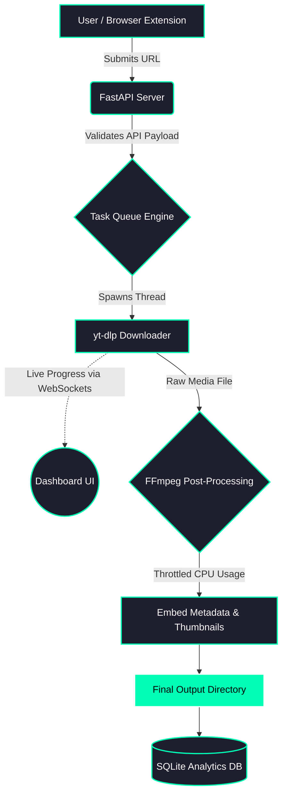

<div align="center">


# 🚀 BURRAQ - Universal Downloader

<p align="center">
  <b>A blazing-fast, stealthy, and premium web-based download manager powered by Python & FastAPI.</b>
</p>

[](https://opensource.org/licenses/MIT)
[](https://www.python.org/)
[](https://fastapi.tiangolo.com/)
[](https://github.com/yt-dlp/yt-dlp)

</div>

---

## 🌟 About The Project
**Burraq** is an advanced, multi-threaded media downloading ecosystem. It combines the raw power of `yt-dlp` and `FFmpeg` with a stunning dark Glassmorphism Web UI. Designed for power users, it features a background system tray engine, smart playlist handling, browser cookie extraction, and real-time WebSocket progress tracking. 

<div align="center">
  
</div>

---

## 🔥 Top 10 Features
1. **⚡ Extreme Concurrency:** Multi-threaded download architecture utilizing `asyncio` for zero UI blocking.
2. **🎨 Premium Glassmorphism UI:** A breathtaking, responsive web dashboard with fluid animations.
3. **🧩 Native Browser Extension:** 1-Click download integration right from your Chrome/Edge browser.
4. **📊 Storage & Insights:** Built-in SQLite analytics dashboard showing daily stats and disk usage.
5. **👻 Stealth & Cookie Bypass:** Automatically imports browser cookies and sets anti-bot headers to bypass strict platform restrictions.
6. **📱 Legacy Device Support:** Custom FFmpeg post-processing to ensure compatibility with feature phones (button mobiles).
7. **🖥️ Windows System Tray:** Runs silently in the background with dynamic right-click context controls.
8. **📥 Smart Playlist Engine:** Auto-creates folders for playlists and organizes files seamlessly.
9. **⚙️ Hardware Throttling:** Smart `Semaphore` limits prevent 100% CPU/GPU bottlenecking during FFmpeg conversions.
10. **📋 Smart Clipboard:** 1-Click URL pasting with native synthetic DOM event dispatching.

---

## 🧠 System Architecture & Flowchart



---

## 🛠️ Built With

* [](#) - Core Backend
* [](#) - API & WebSockets
* [](#) - UI Styling
* [](#) - Database & History
* **yt-dlp** & **FFmpeg** - Core Media Engines
* **Inno Setup** - Windows Compilation

---

## 🚀 Getting Started

### Method 1: 1-Click Windows Installer (Recommended)

1. Go to the [Releases](https://github.com/mmizan85/Burraq/releases) page and download `Burraq-Setup.exe`.
2. Run the installer. It will automatically:
* Install the Burraq background server.
* Add `yt-dlp` and `ffmpeg` to your System `PATH`.
* Setup auto-start in the Windows System Tray.


### Method 2: Running from Source (Python)

1. **Clone the repo:**
```bash
git clone https://github.com/mmizan85/Burraq.git

cd Burraq
```


2. **Install requirements:**
```bash
pip install -r requirements.txt
```


3. **Run the server:**
```bash
python server_main.py
```


*The dashboard will be available at `http://127.0.0.1:9090*`

---

## 🧩 Chrome Extension Installation

To enable 1-Click downloads directly from your browser:

1. Open Google Chrome or Microsoft Edge.
2. Navigate to `chrome://extensions/` (or `edge://extensions/`).
3. Turn on **Developer mode** (toggle in the top right).
4. Click **Load unpacked**.
5. Select the `chrome-extension` folder located inside the Burraq installation directory.
6. *Enjoy seamless downloads!*

---

## 💻 Under the Hood (Developer Insights)

* **NullStream Patch:** Hardened against `WinError 6` and `isatty` crashes during headless PyInstaller compilations.
* **Async Resource Locks:** Dual `asyncio.Semaphore` implementation strictly separates network downloading threads from heavy FFmpeg encoding threads.
* **Dynamic Frontend Updates:** Synthetic event dispatching used in vanilla JS to perfectly sync states without heavy frontend frameworks.

---

## 🤝 Contributing

We welcome contributions from the community! If you are a developer looking to improve this project:

1. **Fork** the repository.
2. Create your Feature Branch (`git checkout -b feature/AmazingFeature`).
3. Commit your Changes (`git commit -m 'Add some AmazingFeature'`).
4. Push to the Branch (`git push origin feature/AmazingFeature`).
5. Open a **Pull Request**.

---

## 👨‍💻 Developer

**Mohammad Mijanur Rahman (Mohammad Mizan)** - Dedicated Software Developer specializing in Python automation, system architectures, and UI/UX design.

---
